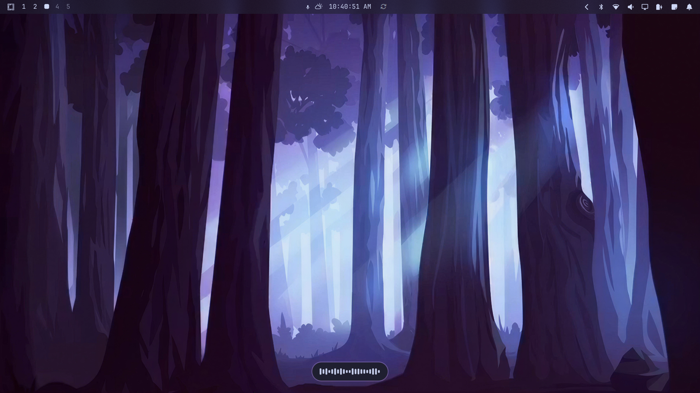

# OmaWispr

A calm, themed Voxtype recording HUD for Omarchy. The bottom-center pill uses
independent rounded bars with a fixed height palette. Microphone peak levels
control which heights are available, while each bar changes independently.



## Requirements

- Omarchy Quickshell with the service plugin contract.
- Voxtype installed and configured.
- `/usr/bin/voxtype-audio-bridge`, provided by the Voxtype setup used by the active Omarchy configuration.

The plugin runs inside the existing Omarchy shell. It does not start another
Quickshell instance, install packages, use elevated privileges, create a
system service, or make network requests.

## Install

```sh
omarchy plugin add https://github.com/ESHAYAT102/omawispr-omarchy-plugin.git --enable
```

Add `esh.omawispr` to the Omarchy shell plugin list if your shell version does
not add it automatically.

Disable Voxtype's stock OSD to avoid two recording indicators:

```sh
voxtype config set osd.enabled false
```

## Usage

Start a Voxtype recording. OmaWispr appears at the bottom center and hides
when recording ends. The HUD follows the focused monitor.

## Remove

```sh
omarchy plugin remove esh.omawispr
```

Removing the plugin removes only OmaWispr. It does not modify Voxtype or the
system configuration. Run this to get the Voxtype OSD back:

```sh
voxtype config set osd.enabled true
```

## License

MIT. See [LICENSE](LICENSE).
